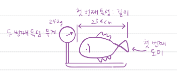
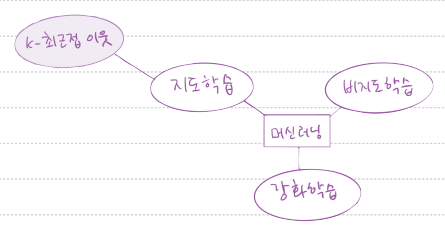
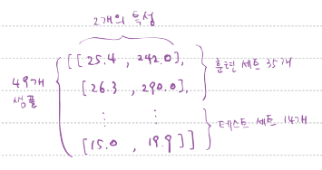

# 혼자 공부하며 함꼐 만드는 혼공 용어 노트

## 01장

#### 인공지능(artificial intelligence)
학습하고 추론할 수 있는 지능을 가진 컴퓨터 시스템을 만드는 기술

#### 강인공지능 vs 약인공지능
강인공지능은 인공일반지능이라고도 하고 사람의 지능과 유사(영화 속 전지전능한 AI)함. 약인공지능은 특정 분야에서 사람을 돕는 보조 AI(음성 비서나 자율 주행도 여기 포함)

#### 머신러닝과 딥러닝(machine learning과 deep learning)
머신러닝은 데이터에서 규칙을 학습하는 알고리즘을 연구하는 분야(대표 라이브러리는 사이킷런). 딥러닝은 인공신경망을 기반으로 한 머신러닝 분야를 일컫음(대표 라이브러리는 텐서플로와 파이토치)

#### 코랩과 노트북(Colab과 Notebook)
코랩은 웹 브라우저에서 텍스트와 프로그램 코드를 자유롭게 작성할 수 있는 온라인 에디터로 이를 코랩 노트북 또는 노트북이라 부름. 최소 실행 단위는 셀이며 코드 셀과 텍스트 셀이 있음

#### 이진 분류(binary classification)
머신러닝에서 여러 개의 종류(혹은 클래스) 중 하나를 구별해 내는 문베를 분류(classification)라고 부르며 2개의 종류(클래스) 중 하나를 고르는 문제를 이진 분류라 함

#### 특성(feature)
데이터를 표현하는 특징으로, 예를 들어 아래 그림과 같이 생선의 특징인 길이와 무게를 특성이라 함

#### 맷플롯립(matplotlib)
파이썬에서 과학계산용 그래프를 그리는 대표 패키지

#### k-최근접 이웃 알고리즘(k-Nearest Neighbors Algorithm, KNN)
가장 간단한 머신러닝 알고리즘 중 하나로 어떤 규칙을 찾기보다는 인접한 샘플을 기반으로 예측을 수행함

#### 훈련(training)
머신러닝 알고리즘이 데이터에서 규칙을 차는 과정 또는 모델에 데이터를 전달하여 규칙을 학습하는 과정

## 02장

#### 지도 학습(supervised learning)
지도 학습은 입력(데이터)과 타깃(정답)으로 이뤄진 훈련 데이터가 필요하며 새로운 데이터를 예측하는 데 활용함. 1장에서 사용한 k-최근접 이웃이 지도 학습 알고리즘임

#### 비지도 학습(unsupervised learning)
타깃 데이터 없이 입력 데이터만 있을 때 사용. 이런 종류의 알고리즘은 정답을 사용하지 않으므로 무언가를 맞힐 수가 없는 대신 데이터를 잘 파악하거나 변형하는데 도움을 줌

#### 훈련 데이터(training data)
지도 학습의 경우 필요한 입력(데이터)과 타깃(정답)을 합쳐 놓은 것

#### 훈련 세트와 테스트 세트(train set와 test set)
모델을 훈련할 때는 훈련 세트를 사용하고 평가는 테스트 세트로 함. 테스트 세트는 전체 데이터에서 20~30%

