# 혼자 공부하며 함꼐 만드는 혼공 용어 노트

## 01장

#### 인공지능(artificial intelligence)
학습하고 추론할 수 있는 지능을 가진 컴퓨터 시스템을 만드는 기술

#### 강인공지능 vs 약인공지능
강인공지능은 인공일반지능이라고도 하고 사람의 지능과 유사(영화 속 전지전능한 AI)함. 약인공지능은 특정 분야에서 사람을 돕는 보조 AI(음성 비서나 자율 주행도 여기 포함)

#### 머신러닝과 딥러닝(machine learning과 deep learning)
머신러닝은 데이터에서 규칙을 학습하는 알고리즘을 연구하는 분야(대표 라이브러리는 사이킷런). 딥러닝은 인공신경망을 기반으로 한 머신러닝 분야를 일컫음(대표 라이브러리는 텐서플로와 파이토치)

#### 코랩과 노트북(Colab과 Notebook)
코랩은 웹 브라우저에서 텍스트와 프로그램 코드를 자유롭게 작성할 수 있는 온라인 에디터로 이를 코랩 노트북 또는 노트북이라 부름. 최소 실행 단위는 셀이며 코드 셀과 텍스트 셀이 있음

#### 이진 분류(binary classification)
머신러닝에서 여러 개의 종류(혹은 클래스) 중 하나를 구별해 내는 문베를 분류(classification)라고 부르며 2개의 종류(클래스) 중 하나를 고르는 문제를 이진 분류라 함

#### 특성(feature)
데이터를 표현하는 특징으로, 예를 들어 아래 그림과 같이 생선의 특징인 길이와 무게를 특성이라 함

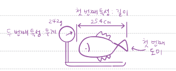

#### 맷플롯립(matplotlib)
파이썬에서 과학계산용 그래프를 그리는 대표 패키지

#### k-최근접 이웃 알고리즘(k-Nearest Neighbors Algorithm, KNN)
가장 간단한 머신러닝 알고리즘 중 하나로 어떤 규칙을 찾기보다는 인접한 샘플을 기반으로 예측을 수행함

#### 훈련(training)
머신러닝 알고리즘이 데이터에서 규칙을 차는 과정 또는 모델에 데이터를 전달하여 규칙을 학습하는 과정

## 02장

#### 지도 학습(supervised learning)
지도 학습은 입력(데이터)과 타깃(정답)으로 이뤄진 훈련 데이터가 필요하며 새로운 데이터를 예측하는 데 활용함. 1장에서 사용한 k-최근접 이웃이 지도 학습 알고리즘임

#### 비지도 학습(unsupervised learning)
타깃 데이터 없이 입력 데이터만 있을 때 사용. 이런 종류의 알고리즘은 정답을 사용하지 않으므로 무언가를 맞힐 수가 없는 대신 데이터를 잘 파악하거나 변형하는데 도움을 줌

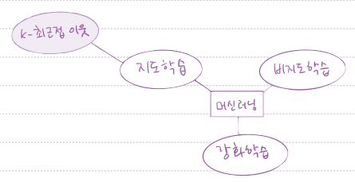

#### 훈련 데이터(training data)
지도 학습의 경우 필요한 입력(데이터)과 타깃(정답)을 합쳐 놓은 것

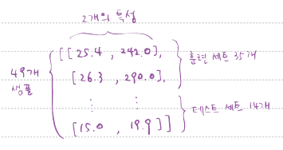

#### 훈련 세트와 테스트 세트(train set와 test set)
모델을 훈련할 때는 훈련 세트를 사용하고 평가는 테스트 세트로 함. 테스트 세트는 전체 데이터에서 20~30%

#### 샘플링 편향 (sampling bias)
훈련 세트와 테스트 세트에 샘플이 고르게 섞여 있지 않을 때 샘플링 편향이 나타나며 제대로 된 지도 학습 모델을 만들 수 없음

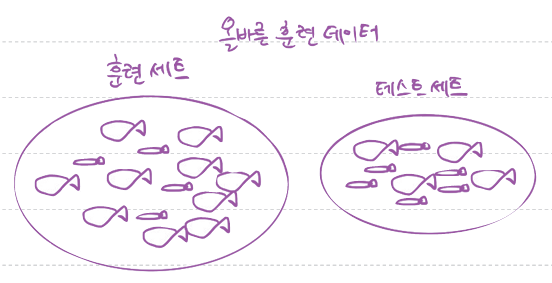

#### 넘파이 (numpy)
파이썬의 대표적인 배열(array) 라이브러리로 고차원의 배열을 손쉽게 만들고 조작할 수 있는 간편한 도구를 많이 제공함.

#### 배열 인덱싱 (array indexing)
넘파이 기능으로 여러 개의 인덱스로 한 번에 여러 개의 원소를 선택할 수 있음

#### 데이터 전처리 (data preprocessing)
머신러닝 모델에 훈련 데이터를 주입하기 전 가공하는 단계로 특성값을 일정한 기준으로 맞추어 주는 작업. 데이터를 표현하는 기준이 다르면 알고리즘을 올바르게 예측할 수 없음

#### 브로드캐스팅 (broadcasting)
조건을 만족하면 모양이 다른 배열 간의 연산을 가능하게 해 주는 기능

## 03장

#### 회귀 (regression)
클래스 중 하나로 분류하는 것이 아니라 임의의 어떤 숫자를 예측하는 문제

#### k-최근접 이웃 분류 vs k-최근접 이웃 회귀

- 참고 용어 = k-최근접 이웃 알고리즘
k-최근접 이웃 알고리즘을 사용해 각각 분류 문제와 회귀 문제를 해결하는 방법

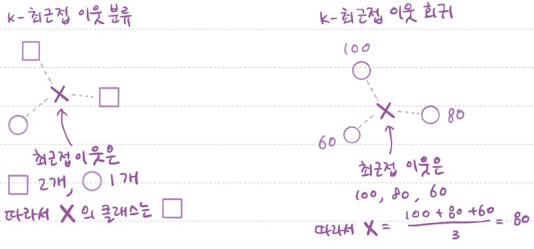

#### 결정계수 ($R^2$) (coefficient of determination)
회귀 모델에서 예측의 적합도를 0과 1 사이의 값으로 계산한 것으로 1에 가까울수록 완벽함

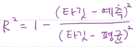

#### 과대적합 vs 과소적합 (overfitting vs underfitting)
과대적합은 모델의 훈련 세트 점수가 테스트 세트 점수보다 훨씬 높을 경우를 의미함. 과소적합은 이와 반대로 모델의 훈련 세트와 테스트 세트 점수가 모두 동일하게 낮거나 테스트 세트 성능이 오히려 더 높을 경우를 의미함

#### 선형 회귀 (linear regression)
널리 사용되는 대표적인 회귀 알고리즘으로 특성이 하나인 경우 어떤 직선을 학습하는 알고리즘(예를 들면, 농어 무게 학습 그래프)

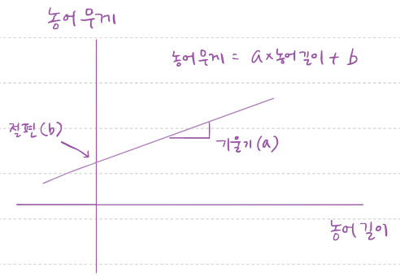

#### 가중치 (또는 계수) (weight (또는 coefficient))
선형 회귀가 학습한 직선의 기울기(위 그림에서 기울기(a))를 종종 가중치 또는 계수라 함

#### 다항 회귀 (polynomial regression)
다항식을 사용하여 특성과 타킷 사이의 관계를 나타낸 선형 회귀

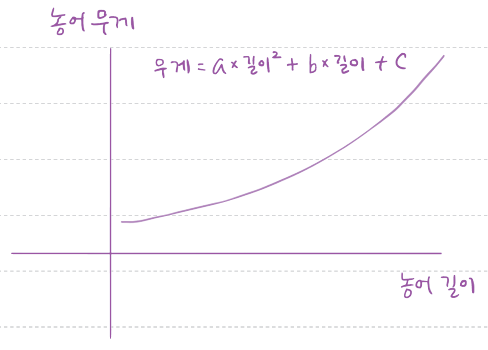

#### 다중 회귀 (multiple regression)
여러 개의 특성을 사용한 선형 회귀

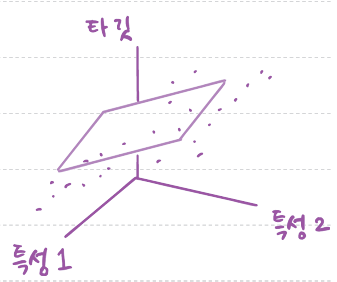 

#### 변환기 (transformer)
특성을 만들거나 전처리하는 사이킷런의 클래스로 타깃 데이터 없이 입력 데이터를 변환함

#### 릿지 회귀 (ridge regression)
규제가 있는 선형 회귀 모델 중 하나로 모델 객체를 만들 때 alpha 매개변수로 규제의 강도를 조절함, alpha 값이 크면 규제 강도가 세지므로 계수 값을 더 줄이고 조금 더 과소적합되도록 유도하여 과대적합을 완화시킴

#### 하이퍼파라미터 (hyperparameter)
머신러닝 모델이 학습할 수 없고 사람이 지정하는 파라미터

#### 라쏘 회귀 (lasso regression)
또 다른 규제가 있는 선형 회귀 모델로 alpha 매개변수로 규제의 강도를 조절함. 릿지와 달리 계수 값을 아예 0으로 만들 수도 있음

## 04장

#### 다중 분류 (multi-class classification)
타깃 데이터에 2개 이상의 클래스가 포함된 문제

#### 로지스틱 회귀 (logistic regression)
선형 방정식을 사용한 분류 알고리즘으로 선형 회귀와 달리 시그모이드 함수나 소프트맥스 함수를 사용하여 클래스 확률을 출력

#### 시그모이드 함수 (sigmoid function)
시그모이드 함수 또는 로지스틱 함수(logistic regression)라고 부르며 선형 방정식의 출력을 0과 1 사이의 값으로 압축하며 이진 분류를 위해 사용. 이진 분류일 경우 시그모이드 함수의 출력이 0.5보다 크면 양성 클래스, 0.5보다 작으면 음성 클래스로 판단

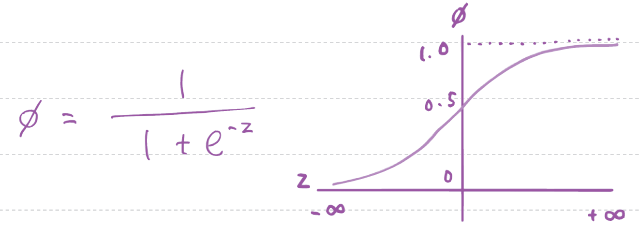

#### 불리언 인덱싱 (boolean indexing)
넘파이 배열은 True, False 값을 전달하여 행을 선택할 수 있으며 이를 불리언 인덱싱이라고 함

#### 소프트맥스 함수 (softmax function)
여러 개의 선형 방정식의 출력값을 0~1 사이로 압축하고 전체 합이 1이 되도록 만들며 이를 위해 지수 함수를 사용하기 때문에 정규화된 지수 함수라고도 함

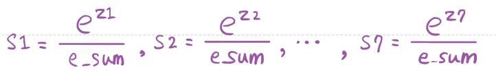

#### 확률적 경사 하강법 (Stochastic Gradient Descent)
훈련 세트에서 랜덤하게 하나의 샘플을 선택하여 손실 함수의 경사를 따라 최적의 모델을 찾는 알고리즘

#### 에포크 (epoch)
확률적 경사 하강법에서 훈련 세트를 한 번 모두 사용하는 과정

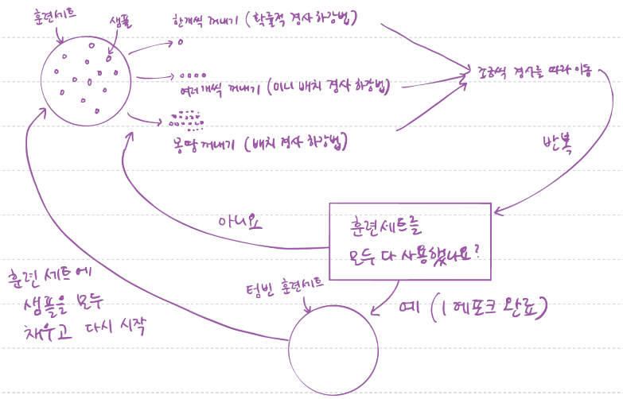

#### 미니배치 경사 하강법 (minibatch gradient descent)
1개가 아닌 여러 개의 샘플을 사용해 경사 하강법을 수행하는 방법으로 실전에서 많이 사용

#### 배치 경사 하강법 (batch gradient descent)
한 번에 전체 샘플을 사용하는 방법으로 전체 데이터를 사용하므로 가장 안정적인 방법이지만 그만큼 컴퓨터 자원을 많이 사용함. 또한 어떤 경우는 데이터가 너무 많아 한 번에 전체 데이터를 모두 처리하지 못할 수 있음.

#### 손실 함수 (loss function)
어떤 문제에서 머신러닝 알고리즘이 얼마나 엉터리인지를 측정하는 기준.

#### 로지스틱 손실 함수 (logistic loss function) - 이진 크로스엔트로피 손실 함수라고도 함
양성 클래스(타깃 = 1)일 때 손실은 -log(예측 확률)로 계산하며, 1 확률이 1에서 멀어질수록 손실은 아주 큰 양수가 됨. 음성 클래스(타깃 = 0)일 때 손실은 -log(1-예측 확률)로 계산함. 이 예측 확률이 0에서 멀어질수록 손실은 아주 큰 양수가 됨

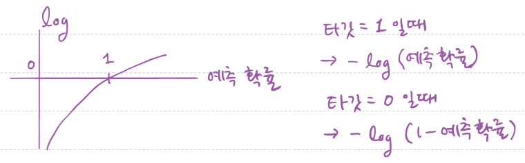

#### 크로스엔트로피 손실 함수 (cross-entropy loss function)
다중 분류에서 사용하는 손실 함수

#### 힌지 손실 (hinge loss)
서포트 벡터 머신(support vector machine)이라 불리는 또 다른 머신러닝 알고리즘을 위한 손실 함수. SGDClassifier가 여러 종류의 손실 함수를 loss 매개변수에 지정하여 
다양한 머신러닝 알고리즘을 지원함

## 05장

#### 결정 트리 (Decision Tree)
스무고개와 같이 질문을 하나씩 던져 정답을 맞춰가며 학습하는 알고리즘으로 비교적 예측 과정을 이해하기 쉬움

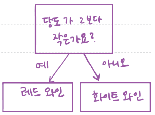

#### 
####
####
####
####
####
####
####
####
####
#### 
####
####
####
####
####
####
####
####
####
#### 
####
####
####
####
####
####
####
####
####
#### 
####
####
####
####
####
####
####
####
####
#### 
####
####
####
####
####
####
####
####
####
#### 
####
####
####
####
####
####
####
####
####
#### 
####
####
####
####
####
####
####
####
####
#### 
####
####
####
####
####
####
####
####
####
#### 
####
####
####
####
####
####
####
####
####
#### 
####
####
####
####
####
####
####
####
####
#### 
####
####
####
####
####
####
####
####
####