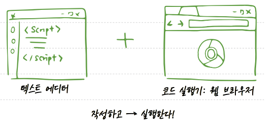
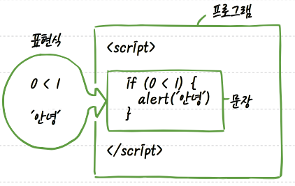

# 혼자 공부하며 함께 만드는 혼공 용어 노트

## 01장
- 하이퍼링크(hyperlink) : 문서 내의 요소에 다른 문서로 이동할 수 있도록 연결해놓은 참조 고리.

- 애플리케이션(application) : 응용 프로그램, 다양한 프로그래밍 언어로 애플리케이션을 만들 수 있다.  
ex) 웹, 웹 서버, 모바일, 데스크톱 애플리케이션 등  
-> 모바일은 리액트 네이티브, 데스크톱은 일렉트론으로 만들 수 있다.

- 에크마스크립트(ECMAScript)   
  : 다양한 웹 브라우저에서 자바스크립트 언어가 잘 작동되도록 자바스크립트를 표준화하기 위해 만들어진 자바스크립트 표준 명칭, 대부분의 브라우저에서 ECMAScript 2015(ECMAScript 6 또는 ES6) 이상의 기능이 구현되고 있으며 현재 ECMAScript 2020(ES11)까지 나왔다.

- 개발환경(development environment)  
  : 프로그램을 개발을 할 수 있게 해주는 환경. 코드를 작성하는 텍스트 에디터와 코드 실행기가 필요하다. 웹 개발 시에 텍스트 에디터는 비주얼 스튜디오 코드, 코드 실행기는 구글 크롬 웹 브라우저를 사용할 수 있다.

  

- 코딩 스타일 (coding style)  
  : 개발자마다 다른 코드 작성 방식을 통일한 코드 작성 규칙. 코딩 컨벤션(coding convention)이라고도 부른다. 언어마다 있는 표준 스타일을 따르거나 팀이나 회사에서 정한 스타일을 따를 수 있다.
  ex) 들여쓰기를 2개 할 것인지 4개 할 것인지, 중괄호의 위치는 어떻게 할 것인지, 키워드 뒤에 괄호를 바르 붙일지 공백을 줄지 등...

- 표현식(expression) : 어떠한 값을 만들어내는 간단한 코드. 숫자, 수식, 문자열 등

- 문장(statement) : 표현식이 하나 이상 모인 것. 문장 끝에는 마침표를 찍듯이 세미콜론 또는 줄바꿈을 넣어준다. 

  

- 키워드(keyword) : 특별한 의미가 있는 단어. 언어 내에서 문법적인 용도로 사용되고 있는 단어로 사용자가 지정하는 이름에는 사용할 수 없다.

- 식별자(identifier) : 프로그래밍 언어에서 이름을 붙일 때 사용하는 단어. 주로 변수명이나 함수명 등으로 사용한다.

 

  자바스크립트 식별자를 만들 때 규칙
  - 키워드를 사용하면 안된다.
  - 숫자로 시작하면 안된다.
  - 특수문자는 _와 $만 허용한다.
  - 공백 문자를 포함할 수 없다.
## 02장
## 03장
## 04장
## 05장
## 06장
## 07장
## 08장
## 09장
## 10장

### 플럭스 패턴 (Flux pattern)
디자인 패턴의 일종. Flux 아키텍처라고도 한다.
- MobX 라이브러리: Flux 패턴으로 데이터를 쉽게 관리할 수 있다.

