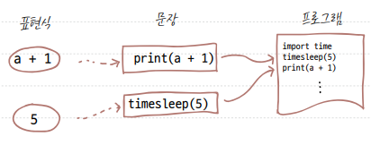

# 혼자 공부하는 파이썬 용어 노트

## 01장 파이썬 시작하기

1. 이진 숫자(binary digit) : 0과 1로 이루어진 수.

2. 프로그래밍 언어(programming language) : 컴퓨터가 이해할 수 있는 이진 코드로 변환되는 것을 목표로 만들어진, 사람이 쉽게 이해할 수 있는 형태의 언어.
- 대표적인 프로그래밍 언어로는 파이썬, C, C#, C++, 자바, 루비, 자바스크립트 등

3. 소스 코드(source code)
- 사람들이 쉽게 읽고 이해할 수 있도록 프로그래밍 언어로 작성한 코드.
- 사람들은 이 코드로 작성하는 읽는 것이 힘들기 때문에 프로그래밍 언어로 소스 코드를 만들고, 이를 컴퓨터가 이해하는 이진 코드로 바꾼다.

4. 텍스트 에디터(text editor)
- 글자를 입력할 수 있는 모든 종류의 프로그램.
- 메모장도 텍스트 에디터이며, 프로그래밍 작성 시 사용할 수는 있으나 최대한 프로그래밍 언어를 쉽게 작성할 수 있도록 도와주는 텍스트 에디터를 사용하면 좋다.
- 텍스트 에디터의 종류에는 비주얼 스튜디오 코드(Visual Studio Code) 외에 서브라임 텍스트(SubTime Text), 아톰(Atom) 등이 있다.

5. 통합 개발 환경(IDE; Integrated Development Environment)
- 텍스트 에디터와 코드 실행기, 이 두 가지를 모두 포함하고 있는 프로그램.
- 프로젝트 생성, 자동 코드 완성, 디버깅 기능을 제공하는 환경을 말한다.
  * 디버깅 : 프로그램 내의 코드 오작동을 찾아내는 것
- ex) 자바의 이클립스, C언어의 Visual Studio

6. 개발 환경(development environment)
- 컴퓨터, 텍스트 에디터, 파이썬 인터프리터 등과 같이 프로그래밍을 할 수 있는 환경.
- 텍스트 에디터를 포함해서 컴파일러 버전과 같은 개발 플랫폼을 말한다.
- 웹 프로그래밍에선 웹 브라우저도 개발 환경이 된다.
- 개발 환경이 달라지면 프로그램의 작동 결과가 다를 수 있다.

7. 인터프리터(interpreter)
- 프로그래밍 소스 코드를 곧바로 실행해 주는 프로그램.
- 한 번에 코드 한 줄씩 읽어 실행.
- 파이썬 코드를 실행할 수 있는 도구는 파이썬 인터프리터.

8. 대화형 셀(interactive shell)
- 컴퓨터와 상호 작용하는 공간이라는 의미에서 대화형 셀이라고 부른다.
- 프롬프트라고 불리는 >>>에 코드를 한 줄 한 줄 입력하면 곧바로 실행결과를 볼 수 있다.

9. 표현식(expression)
- 어떠한 값을 만들어 내는 간단한 코드. 값이란 숫자, 수식, 문자열 등을 의미한다.

10. 문장(statement)
- 표현식이 하나 이상 모인 것. 파이썬에서는 한 줄이 하나의 문장이 된다.

  

11. 키워드(keyword)
- 의미가 부여된 특별한 단어.
- 언어 내에서 문법적인 용도로 사용되고 있는 단어.
- 사용자가 지정하는 이름에는 사용 불가.

12. 식별자(identifier)
- 함수나 변수의 이름을 붙일 때 사용하는 단어.
- 식별자를 만들 때는 특별한 규칙을 따라야 한다.
  - 스네이크 케이스(snake_case) : 단어 사이에 _기호를 붙여 만든 식별자.

    ```python
    phone_number = "010-XXXX-XXXX"
    ```

  - 캐멀 케이스(CamelCase) : 단어들의 첫 글자를 대문자로 만든 식별자. 클래스 식별자를 만들 때 사용.

    ```python
    class WorldMap:
      pass
    ```
  - 파스칼 케이스 : 캐멀 케이스 중에서 첫 번째 글자가 대문자인 것.

    ```python
    Class Person:
      pass
    ```

13. 변수(variable)
- 값을 저장할 때 사용하는 식별자.
- 이름은 '변수'이지만 숫자뿐만 아니라 모든 자료형을 저장할 수 있다.
  - 선언 : 변수를 사용하려면 식별자는 무엇이고, 어떤 데이터를 가진다라는 것을 알려줘야 하는데, 이는 변수를 '선언한다'라고 한다.