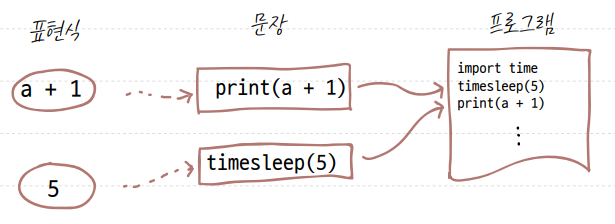
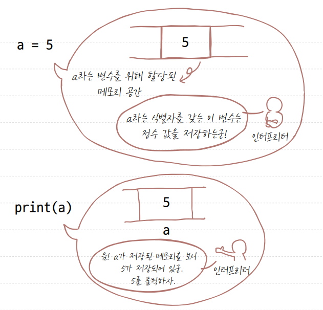
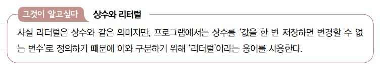
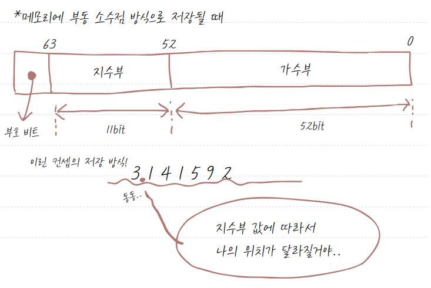
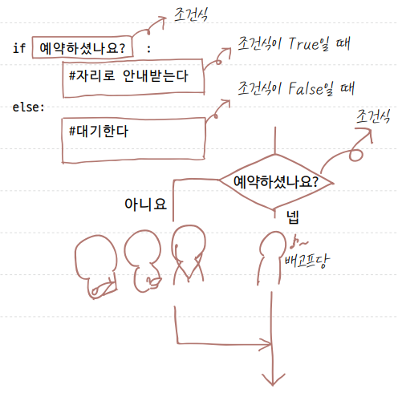
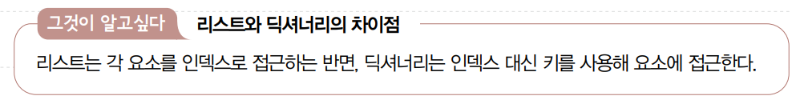

# 혼자 공부하는 파이썬 용어 노트

## 01장 파이썬 시작하기
### 이진숫자 (binary digit)
0과 1로 이루어진 수.

### 프로그래밍 언어 (Programming language)
컴퓨터가 이해할 수 있는 이진 코드로 변환되는 것을 목표로 만들어진, 사람이 쉽게 이해할 수 있는 형태의 언어.
-> 대표적인 프로그래밍 언어로는 C, C#, C++, 자바, 루비, 자바스크립트 등

### 소스 코드 (source code)
사람들이 쉽게 읽고 이해할 수 있도록 프로그래밍 언어로 작성한 코드. <br>
사람들은 이 코드로 작성하고 읽는 것이 힘들기 때문에 프로그래밍 언어로 소스 코드를 만들고, 이를 컴퓨터가 이해하는 이진 코드로 바꾼다.

### 텍스트 에디터 (text editior)
글자를 입력할 수 있는 모든 종류의 프로그램. <br>
메모장도 텍스트 에디터이며, 프로그래밍 작성 시 사용할 수는 있으나 최대한 프로그래밍 언어를 쉽게 작성할 수 있도록 도와주는 텍스트 에디터를 사용하면 좋다. <br>
텍스트 에디터의 종류에는 비주얼 스튜디오 코드(Visual Studio Code) 외에 서브라임 텍스트(Sublime Text), 아톰(Atom) 등이 있다.

### 통합 개발 환경 (IDE; Integrated Development Environment)
텍스트 에디터와 코드 실행기, 이 두 가지를 모두 포함하고 있는 프로그램. <br>
프로젝트 생성, 자동 코드 완성, 디버깅 기능을 제공하는 환경을 말한다. <br>
ex) 자바의 이클립스, C언어의 Visual Studio
- 디버깅: 프로그램 내의 코드 오작동을 찾아내는 것

### 개발 환경 (development environment)
컴퓨터, 텍스트 에디터, 파이썬 인터프리터 등과 같이 프로그래밍을 할 수 있는 환경. <br>
텍스트 에디터를 포함해서 컴파일러 버전과 같은 개발 플랫폼을 말한다. <br>
웹 프로그래밍에선 웹 브라우저도 개발 환경이 된다. <br>
개발 환경이 달라지면 프로그램의 작동 결과가 다를 수 있다. 

### 인터프리터 (interpreter)
프로그래밍 소스 코드를 곧바로 실행해 주는 프로그램. <br>
한 번에 코드 한 줄씩 읽어 실행. <br>
파이썬 코드를 실행할 수 있는 도구는 파이썬 인터프리터. 

### 대화형 셀 (interactive shell)
컴퓨터와 상호 작용하는 공간이라는 의미에서 대화형 셀이라고 부른다. <br>
프롬프트라고 불리는 >>>에 코드를 한 줄 한 줄 입력하면 곧바로 실행결과를 볼 수 있다.

### 표현식 (expression)
어떠한 값을 만들어 내는 간단한 코드. 값이란 숫자, 수식, 문자열 등을 의미한다.

### 문장 (statement)
표현식이 하나 이상 모인 것. 파이썬에서는 한 줄이 하나의 문장이 된다.


### 키워드 (keyword)
의미가 부여된 특별한 단어. <br>
언어 내에서 문법적인 용도로 사용되고 있는 단어. <br>
사용자가 지정하는 이름에는 사용 불가. 

### 식별자 (identifier)
함수나 변수의 이름을 붙일 때 사용하는 단어. <br>
식별자를 만들 때는 특별한 규칙을 따라야 한다.
- 스네이크 케이스(snake_case): 단어 사이에 _기호를 붙여 만든 식별자.
  ```py
  phone_number = "010-XXXX-XXXX"
  ```
- 캐멀 케이스(CamelCase): 단어들의 첫 글자를 대문자로 만든 식별자. 클래스 식별자를 만들 때 사용.
  ```py
  class WorldMap:
    pass
  ```
- 파스칼 케이스: 캐멀 케이스 중에서 첫 번째 글자가 대문자인 것.
  ```py
  Class Person:
      pass
  ```

### 변수 (variable)
값을 저장할 때 사용하는 식별자.<br>
이름은 '변수'이지만 숫자뿐만 아니라 모든 자료형을 저장할 수 있다. 
- 선언: 변수를 사용하려면 식별자는 무엇이고, 어떤 데이터를 가진다라는 것을 알려줘야 하는데, 이는 변수를 '선언한다'라고 한다.
- 할당: 변수에 값을 넣는 것을 '할당한다'라고 한다. (메모리에 변수의 값이 들어갈 공간을 할당해야 하므로)
- 참조: 변수에 접근하는 것을 '참조한다'라고 한다. (결국 변수가 저장된 메모리에 접근하는 것인데, 이 메모리의 '주소'를 참조한다고 생각하면 된다!)


### 함수 (function) ([참고 용어] 매개변수)
코드의 집합. <br>
식별자 뒤에 괄호가 붙어 있으면 해당 식별자는 함수.
- 함수 호출: 함수를 사용하는 것. 함수를 호출할 때는 괄호 내부에 여러 가지 자료를 넣게 되는데, 이러한 자료를 '매개변수'라 하고, 함수를 호출해서 최종적으로 나오는 결과를 '리턴값'이라고 한다.
- 함수 선언(정의): 함수가 어떤 매개변수를 받아 어떤 동작을 하고 어떤 값을 반환할지 기술하는 것.
  ```py
  def func(mylist):
    return sum(mylist)

  number = [1, 2, 3]
  print(func(number))  # 출력: 6
  ```

### 주석 (comment)
프로그램 실행에는 영향이 없으며, 코드에 설명을 붙이기 위해서 사용하는 것.

### 연산자 (operator)
연산에 사용되는 표시나 기호. 
- 연산자 우선순위: 파이썬의 연산자 우선순위는 알고 있는 것처럼 곱셈과 나눗셈이 덧셈과 뺄셈보다 우선하고, 우선순위가 같을 때는 왼쪽에서 오른쪽 순서로, 우선순위를 무시하고 무조건 먼저 연산하고 싶은 게 있다면 괄호로 감싸준다.
- 사칙 연산자, // 연산자, 나머지 연산자, 제곱 연산자, 대입 연산자, 복합 대입 연산자

### 리터럴 (literal)
소스 코드 내에서 직접 입력된 값. <br>
자료(data)라고도 한다.


## 02장 자료형
### 자료형 (data type)
자료의 형태. <br>
자료형에 따라 컴퓨터가 처리하는 방법이 달라진다.<br>
파이썬의 기본 자료형
- 숫자: 소수점이 없는 정수형과 소수점이 있는 실수형으로 구분.<br>
사칙 연산자(+, -, *, /)와 정수 나누기 연산자(//), 나머지 연산자(%), 제곱 연산자(**) 사용
- 문자열: 문자의 나열. 큰따옴표 혹은 작은따옴표로 입력. <br>
문자열 연결 연산자(+), 문자열 반복 연산자(*), 문자열 선택 연산자([]), 문자열 범위 선택 연산자([:]) 사용
- 불: True와 False를 나타내는 값. 반드시 첫 글자는 대문자.

### 이스케이프 문자 (escape character)
\ (백슬래스) 기호가 붙은 특수한 문자 리터럴. 문자열 내부에서 특수한 기능을 수행.

### 인덱스 (index)
리스트, 문자열과 같은 자료형에서 자료가 메모리에 저장된 순서대로 매겨진 번호. <br>
리스트 내부에서 값의 위치를 의미.
- 제로 인덱스: 숫자를 0부터 세는 인덱스. 파이썬은 제로 인덱스 사용.
- 원 인덱스: 숫자를 1부터 세는 인덱스.
  ```py
  mylist = [1, 2, 3]
  print(mylist[0])  # 출력: 1
  ```

### 부동 소수점 (floating point)
소수점이 있는 실수 데이터를 저장하는 방식. <br>
'부동'은 '떠다니다'의 의미, 소수점이 떠다닌다는 의미에서 부동 소수점이라고 함. <br>
이 방식에서는 최상위 비트(MSB: Most Significant Bit)를 부호로 결정.
최상위 비트가 0이면 양수, 1이면 음수.


### 캐스트 (cast)
어떤 자료형을 다른 자료형으로 바꾸는 것. <br>
특히 input() 함수의 입력 자료형은 항상 문자열이기 때문에 입력받은 문자열을 숫자로 변환해야 숫자 연산에 활용 가능.
```py
# input 값으로 들어오는 문자열 형태의 숫자를 정수형으로 변환
n = int(input())
```

## 03장 조건문
### 조건문 (conditional statement)
조건에 따라 코드를 실행하거나 실행하지 않게 만들고(실행 흐름을 바꾸고) 싶을 때 사용하는 구문. <br>
실행 흐름을 바꾸는 것. -> 조건 분기
- if문: 괄호 내의 조건식이 참이면 블록 내의 문장을 실행.
- else문: if문의 조건식이 거짓이면 블록 내의 문장을 실행. 필요 없으면 안 써도 됨.
- else if문: if문의 조건식이 거짓일 때 실행시킬 코드에 추가 조건을 걸고 싶은 경우에 사용. 마찬가지로 필요 없으면 else if를 사용하지 않아도 됨.


### 들여쓰기 (indent)
코드 앞에 사용하는 '띄어쓰기 4번', '띄어쓰기 2번', '탭'과 같은 것을 의미. <br>
파이썬 개발에서는 일반적으로 '띄어쓰기 4번'을 많이 사용.


### 비교 연산자 (comparison operators)
불을 만드는 연산자. <br>
숫자의 크기 비교나 문자열을 비교.

### 논리 연산자 (logical operators)
비교 연산자로 만들어진 불끼리 연산할 수 있는 연산자.
- not: 불을 반대로 전환. True는 False로, False는 True로.
- and: 피연산자 두 개가 모두 참일 때 True를 출력하며, 나머지의 경우는 모두 False를 출력.
- or: 피연산자 두 개 중에 하나만 참이라도 True를 출력하며, 두 개가 모두 거짓일 때만 False를 출력

## 04장 반복문
### 반복문 (loop statement)
조건문과 같이 프로그램의 진행을 바꿀 때 사용하는 것. <br>
매우 많은 횟수 또는 무한하게 반복 작업을 하고 싶을 때 사용하는 문법.
- for문: 반복 횟수가 정해졌거나 변수가 이터러블한 경우에 주로 사용. -> 이 경우 range() 함수 사용
- while문: 반복 횟수를 모르거나 무한 루프를 만들 때 주로 사용.
- break문: 반복문, 조건문 블럭을 빠져 나오게 하는 키워드.
- continue문: 반복문 내에서 continue문을 만나면 아래에 있는 코드를 실행하지 않고 위로 돌아가 반복문 조건을 검사한 후 반복을 할지 말지를 결정. <br>
주로 조건문 안에 넣어 사용.
  ```py
  # 리스트와 for 반복문
  for n in mylist:
    print(n)        # 리스트의 요소 출력
  
  # 딕셔너리와 for 반복문
  for key in mydict:  # key는 딕셔너리의 키!
    print(key)
  for value in mydict.values():  # value는 딕셔너리의 값!
    print(value)
  for key, value in mydict.items():
    print('key: {}'.format(key))
    print('value: {}'.format(value))
  
  # range()를 사용한 반복문
  for i in range(5):  # 5회 반복
    print(i)

  # 리스트, 범위, for 반복문 조합하기
  for i in range(len(array)):
  print("{}번째 반복: { }".format(i, array[i]))

  # while 반복문
  i = 0
  while i < 10:
  print("{}번째 반복입니다.".format(i))
  i += 1
  ```
  

### 이터러블 (iterable)
반복을 적용할 수 있는 성질. <br>
내부에 있는 요소들을 차례차례 꺼낼 수 있는 객체.
- 문자열
- 리스트
- 딕셔너리
- 범위(range() 함수)

### 비파괴적 함수 (non destructive function)
원본을 변화시키지 않는 함수. -> 종류: str 자료형의 lower(), upper(), split() 등

### 파괴적 함수 (destructive function)
원본을 변화시키는 함수. -> 종류: list 자료형의 append(), remove(), pop() 등

### 리스트 내포 (list comprehension)
반복문의 요소를 삽입할 때, 한 줄로 작성할 수 있도록 제공하는 문법.
```py
# 리스트를 선언합니다. 
array = [i * i for i in range(0, 20, 2)]
# 출력합니다. 
print(array)
```

### 전개 연산자 (spread operator)
리스트 요소를 나열해 주는 연산자. 리스트 앞에 * 기호를 사용한다.

## 05장 함수
### 리턴 (return)
함수를 실행했던 위치로 돌아가게 하는 것.<br>
리턴값을 가지는 함수는 반드시 리턴할 때 반환하는 값이 있어야 한다. <br>
(리턴값: 함수의 실행 결괏값.)
- 조기 리턴: 함수 내의 필요한 위치에서 return 키워드를 사용하는 것.

### 매개변수 (parameter)
함수를 호출할 때 필요한 데이터를 외부로부터 받기 위해 사용하는 것.
- 가변 매개변수: 매개변수를 원하는 만큼 받을 수 있는 함수.
- 기본 매개변수: 매개변수를 입력하지 않았을 경우 들어가는 기본값.