# Music Project

풀스택 음악 게시판 및 플레이어 웹 애플리케이션

> **Spring Boot** (Backend) + **React** (Frontend) + **Oracle Database**로 구성된 개인 음악 관리 및 커뮤니티 플랫폼

---

## 목차

1. [프로젝트 개요](#프로젝트-개요)
2. [기술 스택](#기술-스택)
3. [요구사항 명세서](#요구사항-명세서)
4. [시스템 아키텍처](#시스템-아키텍처)
5. [API 명세](#api-명세)
6. [데이터베이스 설계](#데이터베이스-설계)
7. [디렉터리 구조](#디렉터리-구조)
8. [설치 및 실행](#설치-및-실행)
9. [주요 기능 소개](#주요-기능-소개)
10. [구현 화면](#구현-화면)
11. [이미지 자산 위치](#이미지-자산-위치)
12. [개발자 참고](#개발자-참고)

---

## 프로젝트 개요

| 항목 | 내용 |
|------|------|
| 프로젝트명 | Music Board & Player |
| 개발 환경 | Windows 11 / JDK 21 / Node.js 18+ |
| 백엔드 | Spring Boot 4.1.0 + Gradle |
| 프론트엔드 | React 19.2.6 (Create React App) |
| 데이터베이스 | Oracle 11g XE |
| 인증 방식 | JWT (24시간 유효) |
| 파일 저장 경로 | `C:/music_storage/` |

### 주요 기능 요약

- 회원가입 / 로그인 (JWT 인증)
- 음악 파일 업로드 및 5가지 디자인의 플레이어
- 나만의 앨범 보관함 관리
- 커뮤니티 게시판 (파일 첨부, 댓글, 페이지네이션)
- 실시간 채팅 (공개방 / 개인 메시지)
- 가사 싱크 표시
- 10가지 테마 (다크 모드 포함)

---

## 기술 스택

### Backend

| 기술 | 버전 | 용도 |
|------|------|------|
| Spring Boot | 4.1.0 | 전체 서버 프레임워크 |
| Spring Data JPA | - | ORM 및 레포지토리 패턴 |
| Spring Security | - | 인증 / 권한 관리 |
| Spring WebSocket | - | 실시간 채팅 |
| JJWT | 0.11.5 | JWT 토큰 생성 / 검증 |
| Lombok | - | 보일러플레이트 코드 제거 |
| Oracle JDBC | - | 데이터베이스 연결 |
| Jackson JSR310 | - | LocalDateTime 직렬화 |
| JUnit 5 | - | 단위 테스트 |

### Frontend

| 기술 | 버전 | 용도 |
|------|------|------|
| React | 19.2.6 | UI 프레임워크 |
| React Router DOM | 7.15.0 | 클라이언트 사이드 라우팅 |
| Axios | 1.16.0 | HTTP 클라이언트 |
| HTML5 Audio API | - | 음악 재생 |
| WebSocket API | - | 실시간 채팅 |
| CSS Variables | - | 테마 시스템 |

---

## 요구사항 명세서

### 시스템 요구사항

| 구성 요소 | 요구 사항 |
|----------|----------|
| JDK | 21 이상 |
| Node.js | 18 이상 (npm 포함) |
| Oracle Database | 11g XE 이상 |
| OS | Windows (C:/music_storage/ 경로 사용) |
| 저장 공간 | 애플리케이션 코드 ~100MB + 업로드 파일 |
| 파일 업로드 크기 | 최대 50MB / 요청 |

---

### 기능 요구사항 (Functional Requirements)

#### FR-01. 사용자 인증

| ID | 요구사항 | 우선순위 |
|----|---------|---------|
| FR-01-1 | 사용자는 username / password로 회원가입을 할 수 있어야 한다. | 필수 |
| FR-01-2 | 사용자는 username / password로 로그인하고 JWT 토큰을 발급받아야 한다. | 필수 |
| FR-01-3 | 비밀번호는 BCrypt 방식으로 암호화하여 저장되어야 한다. | 필수 |
| FR-01-4 | JWT 토큰은 24시간 동안 유효해야 한다. | 필수 |
| FR-01-5 | 로그인하지 않은 사용자는 음악 업로드, 게시글 작성 등 수정 기능에 접근할 수 없어야 한다. | 필수 |
| FR-01-6 | 각 리소스의 수정/삭제는 해당 리소스를 생성한 사용자만 수행할 수 있어야 한다. | 필수 |

#### FR-02. 음악 관리

| ID | 요구사항 | 우선순위 |
|----|---------|---------|
| FR-02-1 | 로그인한 사용자는 음악 파일(MP3 등)을 업로드할 수 있어야 한다. | 필수 |
| FR-02-2 | 업로드 시 음악 파일의 제목, 아티스트, 가사, 커버 이미지를 입력할 수 있어야 한다. | 필수 |
| FR-02-3 | MP3 파일에서 ID3 태그(제목, 아티스트, 커버 이미지)를 자동 추출해야 한다. | 권장 |
| FR-02-4 | 업로드한 사용자는 음악의 제목, 아티스트, 가사, 커버 이미지를 수정할 수 있어야 한다. | 필수 |
| FR-02-5 | 업로드한 사용자는 자신의 음악을 삭제할 수 있어야 한다. | 필수 |
| FR-02-6 | 음악 파일 및 커버 이미지는 서버의 로컬 스토리지(`C:/music_storage/`)에 저장되어야 한다. | 필수 |

#### FR-03. 음악 플레이어

| ID | 요구사항 | 우선순위 |
|----|---------|---------|
| FR-03-1 | 음악을 재생 / 일시정지할 수 있어야 한다. | 필수 |
| FR-03-2 | 이전 곡 / 다음 곡으로 이동할 수 있어야 한다. | 필수 |
| FR-03-3 | 셔플 재생 모드를 지원해야 한다. | 필수 |
| FR-03-4 | 반복 재생(전체 반복 / 한 곡 반복) 모드를 지원해야 한다. | 필수 |
| FR-03-5 | 플레이어 디자인을 5가지(wall, walkman, boombox, turntable, glass) 중 선택할 수 있어야 한다. | 권장 |
| FR-03-6 | 긴 제목은 마퀴(marquee) 애니메이션으로 스크롤 표시되어야 한다. | 권장 |
| FR-03-7 | 가사 사이드 패널에서 현재 재생 위치에 따라 가사가 싱크되어 표시되어야 한다. | 권장 |

#### FR-04. 앨범 보관함

| ID | 요구사항 | 우선순위 |
|----|---------|---------|
| FR-04-1 | 사용자는 자신의 곡들로 앨범을 만들어 보관할 수 있어야 한다. | 필수 |
| FR-04-2 | 앨범을 선택하면 해당 곡들을 큐에 추가하여 연속 재생할 수 있어야 한다. | 필수 |
| FR-04-3 | 앨범 목록은 그리드 형태로 표시되어야 한다. | 권장 |
| FR-04-4 | 앨범 큐는 localStorage에 저장되어 페이지 새로고침 후에도 유지되어야 한다. | 권장 |

#### FR-05. 게시판

| ID | 요구사항 | 우선순위 |
|----|---------|---------|
| FR-05-1 | 게시글 목록은 10개 단위로 페이지네이션되어야 한다. | 필수 |
| FR-05-2 | 로그인한 사용자는 제목, 내용, 파일을 첨부하여 게시글을 작성할 수 있어야 한다. | 필수 |
| FR-05-3 | 게시글 작성자는 자신의 게시글을 수정 / 삭제할 수 있어야 한다. | 필수 |
| FR-05-4 | 게시글에 댓글을 작성 / 삭제할 수 있어야 한다. | 필수 |
| FR-05-5 | 첨부 파일을 다운로드할 수 있어야 한다. (음악 파일은 로그인 필요) | 필수 |
| FR-05-6 | 게시글 작성 / 조회 / 수정은 모달 UI로 표시되어야 한다. | 필수 |
| FR-05-7 | 첨부 파일은 `C:/music_storage/board/`에 저장되어야 한다. | 필수 |

#### FR-06. 실시간 채팅

| ID | 요구사항 | 우선순위 |
|----|---------|---------|
| FR-06-1 | WebSocket을 통해 실시간 채팅을 지원해야 한다. | 필수 |
| FR-06-2 | 전체 공개방에서 모든 접속자에게 메시지를 브로드캐스트해야 한다. | 필수 |
| FR-06-3 | 특정 사용자에게 1:1 비공개 메시지를 보낼 수 있어야 한다. | 필수 |
| FR-06-4 | 현재 접속 중인 사용자 목록을 표시해야 한다. | 필수 |
| FR-06-5 | 읽지 않은 메시지 수를 배지(badge)로 표시해야 한다. | 권장 |

#### FR-07. 테마 및 UI

| ID | 요구사항 | 우선순위 |
|----|---------|---------|
| FR-07-1 | 10가지 테마(Mood White, Retro Boombox, Cyber Walkman, Mid-Century, All Black Studio, Cyberpunk, Glassmorphism, High-Teen Pink, Ocean Refresh, City Pop Sunset)를 제공해야 한다. | 권장 |
| FR-07-2 | 선택한 테마는 localStorage에 저장되어 재방문 시에도 유지되어야 한다. | 권장 |
| FR-07-3 | 네비게이션 바에서 테마를 전환할 수 있어야 한다. | 권장 |

---

### 비기능 요구사항 (Non-Functional Requirements)

#### NFR-01. 보안

| ID | 요구사항 |
|----|---------|
| NFR-01-1 | 모든 비밀번호는 BCrypt 알고리즘으로 해시하여 저장해야 한다. |
| NFR-01-2 | JWT 시크릿 키는 외부에 노출되지 않아야 한다. |
| NFR-01-3 | 인증이 필요한 API 엔드포인트는 유효한 JWT 토큰 없이 접근이 거부되어야 한다. |
| NFR-01-4 | 타 사용자의 리소스(음악, 게시글, 댓글) 수정/삭제는 서버에서 차단되어야 한다. |
| NFR-01-5 | CSRF는 Stateless JWT 방식이므로 비활성화하고 CORS는 명시적으로 설정해야 한다. |

#### NFR-02. 성능

| ID | 요구사항 |
|----|---------|
| NFR-02-1 | 파일 업로드는 단일 요청당 최대 50MB까지 허용한다. |
| NFR-02-2 | 게시글 목록 조회는 페이지 단위(10개)로 분할하여 응답 크기를 제한해야 한다. |
| NFR-02-3 | 음악 파일은 스트리밍 방식으로 제공되어야 한다. |

#### NFR-03. 유지보수성

| ID | 요구사항 |
|----|---------|
| NFR-03-1 | 백엔드는 Controller → Service → Repository 계층으로 분리되어야 한다. |
| NFR-03-2 | 프론트엔드 상태 관리는 Context API를 사용하여 전역 상태를 관리해야 한다. |
| NFR-03-3 | 예외 처리는 `GlobalExceptionHandler`를 통해 중앙 집중식으로 처리해야 한다. |
| NFR-03-4 | 테마 스타일은 CSS 변수(`var(--*)`)를 통해 단일 지점에서 관리되어야 한다. |

#### NFR-04. 호환성

| ID | 요구사항 |
|----|---------|
| NFR-04-1 | 프론트엔드는 최신 Chrome / Firefox / Edge 브라우저를 지원해야 한다. |
| NFR-04-2 | 백엔드 API는 RESTful 원칙을 준수해야 한다. |

---

## 시스템 아키텍처

```
┌─────────────────────────────────────────────────────────────────┐
│                         Browser (Client)                        │
│                                                                 │
│  React SPA (localhost:3000)                                     │
│  ┌──────────┐  ┌──────────┐  ┌──────────┐  ┌───────────────┐    │
│  │PlayerPage│  │BoardPage │  │AlbumPage │  │Login/Register │    │
│  └──────────┘  └──────────┘  └──────────┘  └───────────────┘    │
│  ┌─────────────────────────────────────────────────────────┐    │
│  │  AuthContext │ ThemeContext │ PlayerDesignContext       │    │
│  └─────────────────────────────────────────────────────────┘    │
└─────────────────────────┬────────────────────────┬──────────────┘
                          │ HTTP (axios)           │ WebSocket
                          │ /api/**, /music/**     │ /ws/chat
                          ▼                        ▼
┌─────────────────────────────────────────────────────────────────┐
│               Spring Boot Server (localhost:8080)               │
│                                                                 │
│  ┌─────────────────┐  ┌─────────────────┐  ┌───────────────┐    │
│  │  JwtFilter      │  │ SecurityConfig  │  │  ChatHandler  │    │
│  └────────┬────────┘  └─────────────────┘  └───────────────┘    │
│           │                                                     │
│  ┌────────▼────────────────────────────────────────────────┐    │
│  │             REST Controllers                            │    │
│  │  AuthController │ SongController │ BoardController      │    │
│  └────────┬────────────────────────────────────────────────┘    │
│           │                                                     │
│  ┌────────▼────────────────────────────────────────────────┐    │
│  │             Services                                    │    │
│  │  UserService    │ SongService    │ BoardService         │    │
│  └────────┬────────────────────────────────────────────────┘    │
│           │                                                     │
│  ┌────────▼────────────────────────────────────────────────┐    │
│  │             Repositories (Spring Data JPA)              │    │
│  └────────┬────────────────────────────────────────────────┘    │
└───────────┼─────────────────────────────────────────────────────┘
            │
┌───────────▼───────────────┐   ┌────────────────────────────────┐
│   Oracle DB (1521)        │   │   File Storage (Local)         │
│   music_project user      │   │   C:/music_storage/            │
│                           │   │   C:/music_storage/board/      │
│   users / song /          │   │                                │
│   board / comments /      │   │   - 음악 파일 (UUID 파일명)    │
│   board_file              │   │   - 커버 이미지                │
└───────────────────────────┘   │   - 게시판 첨부파일            │
                                └────────────────────────────────┘
```

---

## API 명세

### 인증 API (`/api/auth`)

| Method | Endpoint | 인증 | 설명 |
|--------|----------|------|------|
| POST | `/api/auth/register` | 불필요 | 회원가입 |
| POST | `/api/auth/login` | 불필요 | 로그인 → JWT 반환 |

**로그인 요청 Body:**
```json
{ "username": "user1", "password": "pass1234" }
```

**로그인 응답:**
```json
{ "token": "<JWT 토큰>" }
```

---

### 음악 API (`/api/songs`)

| Method | Endpoint | 인증 | 설명 |
|--------|----------|------|------|
| GET | `/api/songs` | 필요 | 내 음악 목록 조회 |
| GET | `/api/songs/{id}` | 필요 (소유자) | 음악 단건 조회 |
| POST | `/api/songs` | 필요 | 음악 업로드 (multipart) |
| PUT | `/api/songs/{id}` | 필요 (소유자) | 음악 메타데이터 수정 |
| PUT | `/api/songs/{id}/image` | 필요 (소유자) | 커버 이미지 수정 |
| DELETE | `/api/songs/{id}` | 필요 (소유자) | 음악 삭제 |

---

### 게시판 API (`/api/board`)

| Method | Endpoint | 인증 | 설명 |
|--------|----------|------|------|
| GET | `/api/board?page={n}` | 불필요 | 게시글 목록 조회 (10개/페이지) |
| GET | `/api/board/{id}` | 불필요 | 게시글 단건 조회 |
| POST | `/api/board` | 필요 | 게시글 작성 (파일 첨부 가능) |
| PUT | `/api/board/{id}` | 필요 (소유자) | 게시글 수정 |
| DELETE | `/api/board/{id}` | 필요 (소유자) | 게시글 삭제 |
| GET | `/api/board/{id}/comments` | 불필요 | 댓글 목록 조회 |
| POST | `/api/board/{id}/comments` | 필요 | 댓글 작성 |
| DELETE | `/api/board/comments/{id}` | 필요 (소유자) | 댓글 삭제 |
| DELETE | `/api/board/files/{id}` | 필요 (소유자) | 첨부파일 삭제 |

---

### 파일 서빙 (Static)

| Endpoint | 설명 |
|----------|------|
| `/music/{파일명}` | 음악 파일 / 커버 이미지 스트리밍 |
| `/board-files/{파일명}` | 게시판 첨부파일 다운로드 |

---

### WebSocket (`/ws/chat`)

연결 시 JWT 토큰을 쿼리 파라미터로 전달해야 합니다: `ws://localhost:8080/ws/chat?token=<JWT>`
핸드셰이크 단계에서 `JwtHandshakeInterceptor`가 토큰을 검증하고, 이후 메시지의 발신자(`sender`)는 클라이언트 값이 아닌 **검증된 세션의 사용자명**을 신뢰합니다. (신원 위조 방지)

| 메시지 타입 | 방향 | 설명 |
|------------|------|------|
| `CONNECT` | Client → Server | 사용자 접속 등록 |
| `PUBLIC` | Client → Server | 공개방 메시지 전송 |
| `PRIVATE` | Client → Server | 개인 메시지 전송 |
| `USER_LIST` | Server → Client | 접속 사용자 목록 갱신 |

---

## 데이터베이스 설계

### ERD (개요)

```
users ────────────────────────────────────────────────
  id (PK)           ┌── song
  username (UNIQUE)  │     id (PK)
  password           │     title
  role               │     artist
                     │     file_path
                     │     image_path
                     │     lyrics (CLOB)
                     └──── user_id (FK → users.id, ON DELETE SET NULL)

users ────────────────────────────────────────────────
  id (PK)           ┌── board
  username           │     id (PK)
                     │     title
                     │     content (CLOB)
                     │     created_at (TIMESTAMP)
                     │     user_id (FK → users.id)
                     │
                     ├── comments
                     │     id (PK)
                     │     content
                     │     created_at (TIMESTAMP)
                     │     author_id (FK → users.id)
                     │     board_id (FK → board.id)
                     │
                     └── board_file
                           id (PK)
                           file_name
                           file_path
                           file_type
                           board_id (FK → board.id)
```

### 주요 테이블

| 테이블 | 컬럼 | 비고 |
|--------|------|------|
| `users` | id, username, password, role | BCrypt 비밀번호, role = 'ROLE_USER' |
| `song` | id, title, artist, file_path, image_path, lyrics, user_id | CLOB for lyrics |
| `board` | id, title, content, created_at, user_id | CLOB for content |
| `comments` | id, content, created_at, author_id, board_id | - |
| `board_file` | id, file_name, file_path, file_type, board_id | - |

---

## 디렉터리 구조

```
Music/
├── Backend/                              # Spring Boot 서버
│   ├── build.gradle                      # Gradle 빌드 설정
│   ├── settings.gradle
│   ├── gradlew / gradlew.bat
│   └── src/main/java/com/pknu26/music/
│       ├── MusicApplication.java         # 진입점
│       ├── config/
│       │   ├── SecurityConfig.java       # Spring Security + JWT + CORS 설정
│       │   ├── WebConfig.java            # 정적 파일 서빙 (CORS는 SecurityConfig)
│       │   ├── WebSocketConfig.java      # WebSocket 엔드포인트 + 핸드셰이크 인터셉터
│       │   ├── PasswordEncoderConfig.java
│       │   └── GlobalExceptionHandler.java
│       ├── controller/
│       │   ├── AuthController.java
│       │   ├── SongController.java
│       │   └── BoardController.java
│       ├── service/
│       │   ├── UserService.java
│       │   ├── SongService.java
│       │   └── BoardService.java
│       ├── repository/
│       │   ├── UserRepository.java
│       │   ├── SongRepository.java
│       │   ├── BoardRepository.java
│       │   ├── CommentRepository.java
│       │   └── BoardFileRepository.java
│       ├── entity/
│       │   ├── User.java
│       │   ├── Song.java
│       │   ├── Board.java
│       │   ├── Comment.java
│       │   └── BoardFile.java
│       ├── security/
│       │   ├── JwtTokenProvider.java         # JWT 생성 / 검증
│       │   ├── JwtFilter.java                # 요청당 JWT 필터
│       │   └── JwtHandshakeInterceptor.java  # WebSocket 핸드셰이크 토큰 검증
│       ├── handler/
│       │   └── ChatHandler.java          # WebSocket 채팅 핸들러
│       └── dto/
│           ├── AuthRequest.java
│           ├── SongResponse.java
│           ├── BoardDTO.java
│           ├── CommentDTO.java
│           └── ChatMessageDTO.java
├── Frontend/                             # React 앱
│   ├── package.json
│   ├── public/
│   │   └── images/                       # 정적 이미지 에셋
│   └── src/
│       ├── App.js                        # 라우트 설정
│       ├── index.js
│       ├── setupProxy.js                 # 개발 프록시
│       ├── pages/
│       │   ├── PlayerPage.jsx            # 메인 뮤직 플레이어
│       │   ├── BoardPage.jsx             # 게시판
│       │   ├── AlbumLibraryPage.jsx      # 앨범 보관함
│       │   ├── LoginPage.jsx
│       │   └── RegisterPage.jsx
│       ├── components/
│       │   ├── Navbar.jsx                # 네비게이션 바 (테마/디자인 선택)
│       │   ├── UploadForm.jsx            # 음악 업로드 모달
│       │   ├── LyricsModal.jsx           # 가사 표시 모달
│       │   ├── LyricsEditModal.jsx       # 가사 편집 모달
│       │   ├── LyricsSidePanel.jsx       # 가사 싱크 패널
│       │   ├── DesignSelector.jsx        # 플레이어 디자인 선택
│       │   ├── SongInfoModal.jsx         # 곡 정보 / 수정 모달
│       │   ├── HelpModal.jsx             # 도움말 모달
│       │   ├── ErrorBoundary.jsx
│       │   └── Spinner.jsx
│       ├── context/
│       │   ├── AuthContext.jsx           # 인증 상태 (JWT, login/logout)
│       │   ├── ThemeContext.jsx          # 테마 상태 (10가지)
│       │   └── PlayerDesignContext.jsx   # 플레이어 디자인 상태
│       └── styles/
│           ├── global.css               # 전역 스타일 + 10가지 테마 CSS 변수
│           ├── Player.css
│           ├── LyricsModal.css
│           ├── LyricsEditModal.css
│           └── SongInfoModal.css
└── sql/
    ├── music_project_schema.sql              # 유저/테이블스페이스 생성
    └── music_project_table and sequence_ schema.sql  # 테이블 & 시퀀스 생성
```

---

## 설치 및 실행

### GitHub Actions

`.github/workflows/music-note-ci.yml`에서 Music 프로젝트의 Backend `assemble`과 Frontend `npm run build`를 자동 실행합니다. `project/Music/**` 변경이 push 또는 pull request로 올라오면 해당 워크플로가 동작합니다.

로컬 Oracle DB가 필요한 Spring Boot 컨텍스트 테스트는 GitHub 러너에서 바로 실패할 수 있어, 현재 CI는 테스트 대신 패키징 가능한지 확인하는 `assemble`을 사용합니다.

### 0. 사전 요구사항

- JDK 21 설치 및 `JAVA_HOME` 환경변수 설정
- Node.js 18+ 및 npm 설치
- Oracle 11g XE 실행 중 (`localhost:1521:xe`)

### 1. 데이터베이스 설정

Oracle SQL*Plus 또는 SQL Developer로 아래 파일을 순서대로 실행합니다.

```sql
-- 1. 사용자 및 테이블스페이스 생성
@sql/music_project_schema.sql

-- 2. 테이블 및 시퀀스 생성
@"sql/music_project_table and sequence_ schema.sql"
```

### 2. 파일 저장 디렉터리 생성

```powershell
New-Item -ItemType Directory -Force -Path "C:\music_storage"
New-Item -ItemType Directory -Force -Path "C:\music_storage\board"
```

### 3. 백엔드 실행

```powershell
cd d:\lyb\Self-Study\project\Music\Backend
.\gradlew.bat bootRun
```

> 서버 기동 후 `http://localhost:8080` 에서 응답 확인

### 4. 프론트엔드 실행

```powershell
cd d:\lyb\Self-Study\project\Music\Frontend
npm install
npm start
```

### 5. 브라우저 접속

| 주소 | 설명 |
|------|------|
| `http://localhost:3000` | React 앱 (메인) |
| `http://localhost:8080` | Backend API |

> 프론트엔드는 `Frontend/src/setupProxy.js`를 통해 `/api`, `/music`, `/board-files`, `/ws` 요청을 `http://localhost:8080`으로 프록시합니다.

---

## 주요 기능 소개

### 음악 플레이어 (PlayerPage)

- 5가지 플레이어 디자인 선택 (Navbar에서 전환 가능)
  - `wall` — 모던 미니멀 벽걸이 스타일
  - `walkman` — Y2K 사이버 워크맨 스타일
  - `boombox` — 80~90년대 레트로 붐박스 스타일
  - `turntable` — 미드 센추리 턴테이블 스타일
  - `glass` — 글래스모피즘 스타일
- 재생 / 일시정지 / 이전 / 다음 곡
- 셔플 / 반복(전체, 한 곡) 재생 모드
- 사이드 패널에서 가사 싱크 표시
- 우측 라이브러리에서 곡 목록 관리 (정렬, 수정, 삭제)

### 앨범 보관함 (AlbumLibraryPage)

- 보유한 곡들로 앨범 생성 및 관리
- 앨범 선택 시 해당 곡을 큐에 추가하여 연속 재생
- 그리드 형태의 앨범 목록

### 게시판 (BoardPage)

- 게시글 목록 10개 단위 페이지네이션
- 게시글 작성 / 조회 / 수정 / 삭제 모달 UI
- 파일 첨부 및 다운로드
- 댓글 작성 / 삭제

### 테마 시스템

10가지 테마를 Navbar에서 전환할 수 있습니다.

| # | 테마명 | 컨셉 |
|---|--------|------|
| 1 | Mood White | MUJI 스타일 미니멀 |
| 2 | Retro Boombox | 80~90년대 레트로 |
| 3 | Cyber Walkman | Y2K 메탈릭 |
| 4 | Mid-Century | Braun / 우드 |
| 5 | All Black Studio | 네온 그린 액센트 |
| 6 | Cyberpunk | 핑크 / 시안 네온 |
| 7 | Glassmorphism | 프로스트 글래스 |
| 8 | High-Teen Pink | 귀여운 핑크 |
| 9 | Ocean Refresh | 아쿠아 / 블루 |
| 10 | City Pop Sunset | 오렌지 / 퍼플 |

---

## 구현 화면

### 로그인 / 회원가입

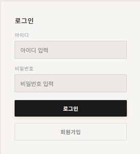 <br />
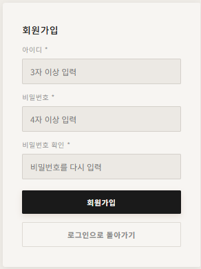

### 음악 플레이어

| 디자인 | 화면 |
|--------|------|
| Wall (미니멀) | 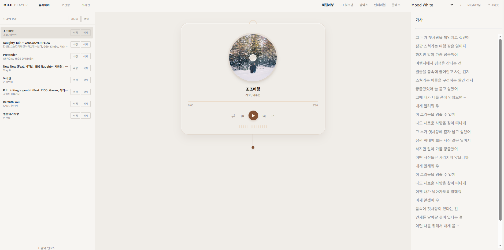 |
| Walkman (Y2K) | 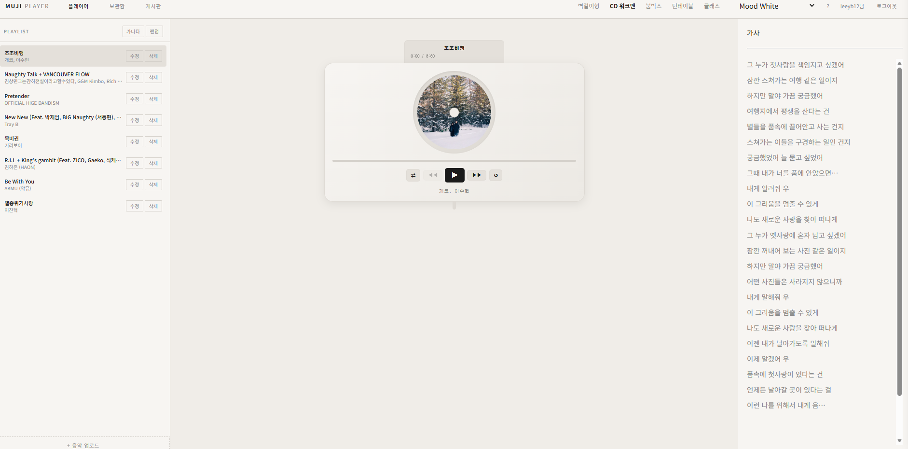 |
| Boombox (레트로) | 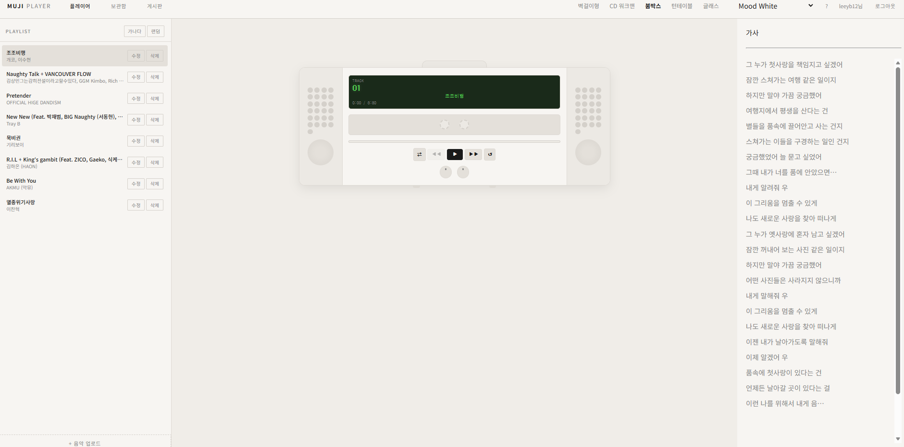 |
| Turntable (미드센추리) | 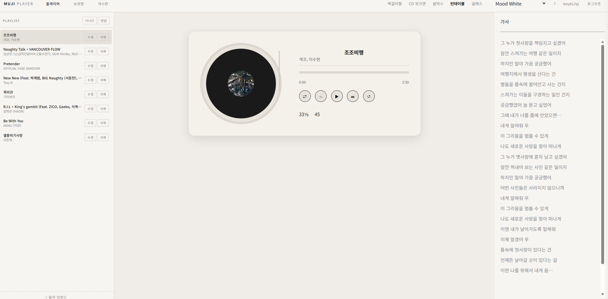 |
| Glass (글래스모피즘) | 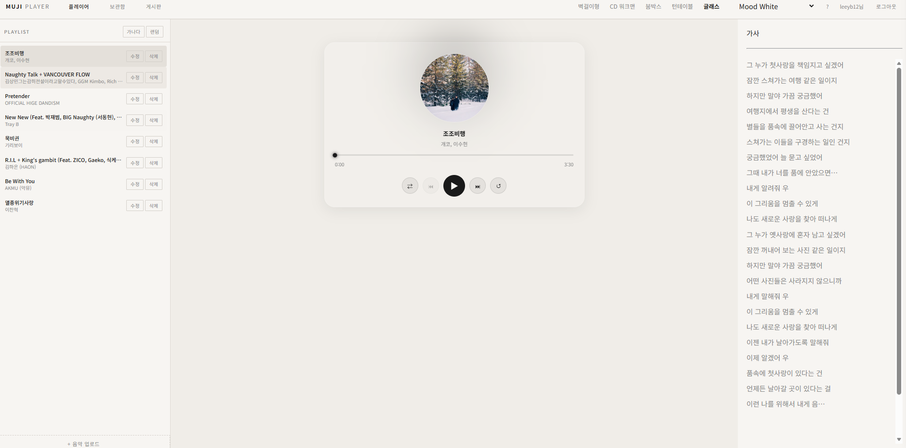 |

### 가사 싱크 패널

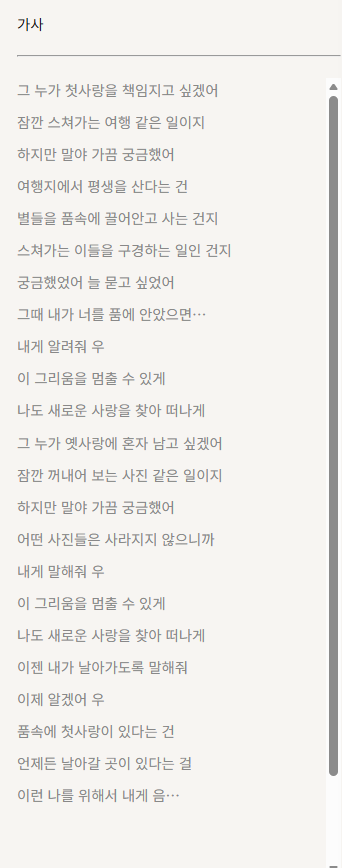

### 앨범 보관함

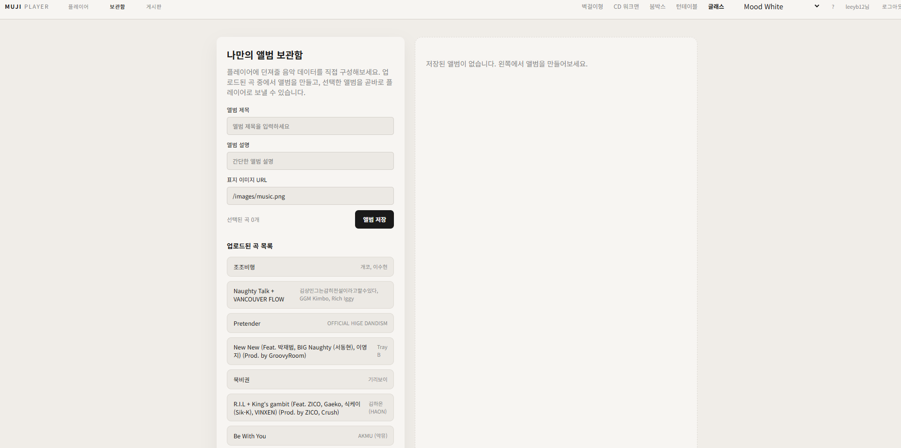

### 게시판 (목록 / 작성 / 댓글)

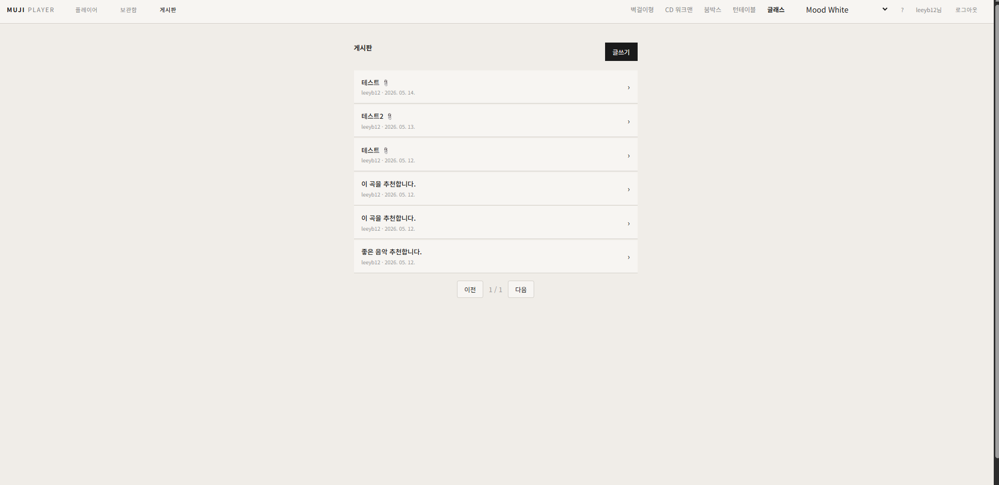

### 테마 전환

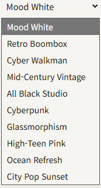

---

## 개발자 참고

- Frontend는 `Create React App` 기반입니다. (`react-scripts 5.0.1`)
- Backend는 Gradle 빌드 시스템을 사용합니다.
- API 호출은 `axios`를 사용하며, `setupProxy.js`로 개발 환경 CORS 문제를 해결합니다.
- 인증 상태는 `Frontend/src/context/AuthContext.jsx`에서 관리됩니다.
- 테마 상태는 `Frontend/src/context/ThemeContext.jsx`에서 CSS 변수(`data-theme`)로 관리됩니다.
- 페이지 스타일은 `Frontend/src/styles/global.css` 및 컴포넌트별 CSS 파일에서 관리됩니다.
- 예외 처리는 `Backend/src/main/java/com/pknu26/music/config/GlobalExceptionHandler.java`에서 중앙 집중식으로 처리합니다.
- DB 접속 정보와 `jwt.secret`은 `application.properties`에서 환경변수로 주입할 수 있습니다. (`DB_URL`, `DB_USERNAME`, `DB_PASSWORD`, `JWT_SECRET` — 미설정 시 기본값 사용) 운영 환경에서는 환경변수로 덮어쓰는 것을 권장합니다.
- CORS는 `SecurityConfig`의 `CorsConfigurationSource` 한 곳에서 관리합니다. (`WebConfig`는 정적 파일 서빙 전용)
