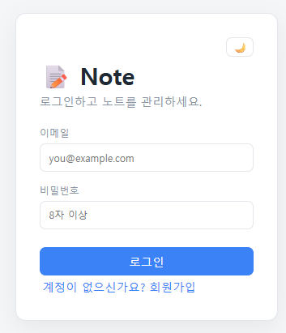
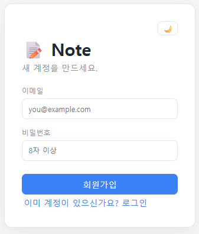
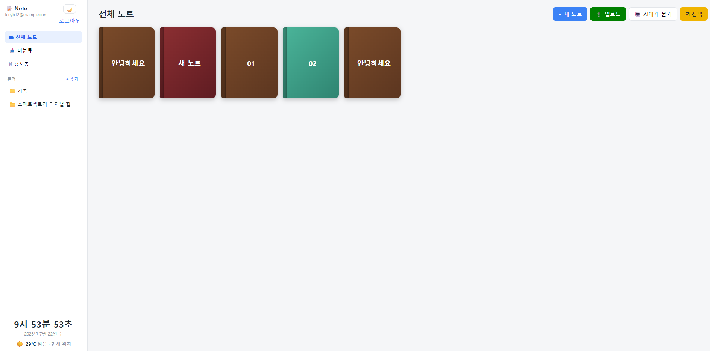
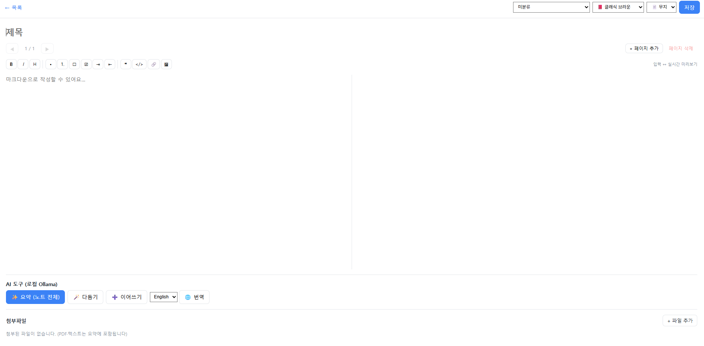
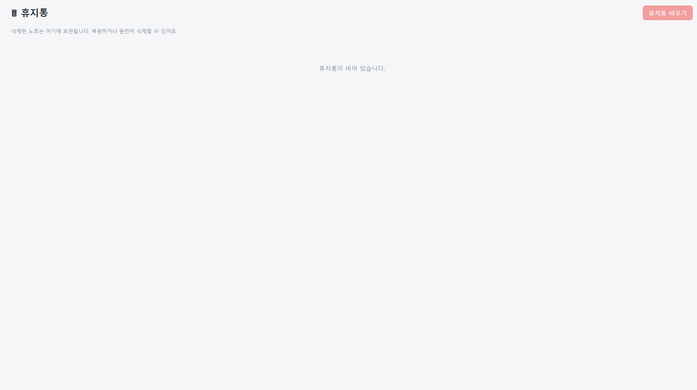

# Note — AI 노트 애플리케이션

로컬 LLM(Ollama)을 활용한 풀스택 노트 작성·관리 애플리케이션입니다.
마크다운 노트 작성, 폴더 정리, 파일 첨부, 휴지통, 그리고 AI 요약·번역·교정·이어쓰기·채팅 기능을 제공합니다.

> **Spring Boot 4.1.0 (JDK 21) + React 19 (Vite) + MariaDB + Ollama** 구성이며, JWT 기반 인증을 사용합니다.

---

## 주요 기능

| 영역 | 기능 |
|------|------|
| **인증** | 회원가입 / 로그인 (JWT 발급, Spring Security) |
| **노트** | 마크다운 노트 작성·조회·수정·삭제 (CRUD) |
| **폴더** | 폴더별 노트 분류 및 관리 |
| **첨부파일** | 노트별 파일 업로드 / 다운로드 / 삭제 (최대 25MB) |
| **휴지통** | 소프트 삭제(`deleted_at`), 복원, 영구 삭제 |
| **PDF** | PDF 첨부파일 뷰어 및 텍스트 추출 |
| **AI 요약** | 노트·문서 내용을 Ollama LLM으로 요약 |
| **AI 도구** | 번역(translate) / 교정(polish) / 이어쓰기(continue) |
| **AI 채팅** | LLM과의 대화형 채팅 |
| **UI** | 다크/라이트 테마 토글 |

---

## 기술 스택

### Backend (`Backend/`)
- **Spring Boot 4.1.0** (JDK 21, Gradle)
- Spring Data JPA / Hibernate
- Spring Security + **JWT** (`io.jsonwebtoken:jjwt 0.12.6`)
- Spring Validation
- **MariaDB** (`mariadb-java-client`)
- **Apache PDFBox 3.0.3** — PDF 텍스트 추출
- Lombok

### Frontend (`Frontend/`)
- **React 19** + **TypeScript 6**
- **Vite 8**
- `marked` (마크다운 렌더링) + `dompurify` (XSS 방지)

### AI
- **Ollama** 로컬 LLM (기본 모델: `gemma`, 환경변수로 변경 가능)

---

## 프로젝트 구조

```
Note/
├── Backend/                        # Spring Boot (Gradle)
│   └── src/main/java/com/pknu26/note/
│       ├── controller/             # Auth, Note, Folder, Attachment, AiTool
│       ├── service/                # 비즈니스 로직 + OllamaClient, TextExtractor, FileStorage
│       ├── repository/             # JPA Repository
│       ├── entity/                 # User, Note, Folder, Attachment
│       ├── dto/                    # 요청/응답 DTO
│       ├── security/               # JWT 필터·토큰 프로바이더·SecurityConfig
│       └── exception/              # 전역 예외 처리
│   └── src/main/resources/
│       ├── application.properties
│       └── sql/                    # 스키마 및 마이그레이션 SQL
└── Frontend/                       # React + Vite
    └── src/
        ├── api/client.ts           # 백엔드 API 클라이언트
        ├── components/             # NoteEditor, NoteReader, FolderSidebar,
        │                           #   AiChat, PdfViewer, TrashGrid 등
        ├── lib/markdown.ts
        └── App.tsx
```

---

## API 엔드포인트

| Method | Path | 설명 |
|--------|------|------|
| POST | `/api/auth/signup` | 회원가입 |
| POST | `/api/auth/login` | 로그인 (JWT 발급) |
| GET | `/api/notes` | 노트 목록 |
| GET | `/api/notes/{id}` | 노트 단건 조회 |
| POST | `/api/notes` | 노트 생성 |
| PUT | `/api/notes/{id}` | 노트 수정 |
| DELETE | `/api/notes/{id}` | 노트 삭제(휴지통 이동) |
| GET | `/api/notes/trash` | 휴지통 목록 |
| POST | `/api/notes/{id}/restore` | 휴지통에서 복원 |
| DELETE | `/api/notes/{id}/permanent` | 영구 삭제 |
| DELETE | `/api/notes/trash` | 휴지통 비우기 |
| POST | `/api/notes/{id}/summarize` | AI 요약 |
| GET / POST / PUT / DELETE | `/api/folders` `…/{id}` | 폴더 관리 |
| GET / POST | `/api/notes/{noteId}/attachments` | 첨부파일 목록/업로드 |
| GET | `/api/attachments/{id}/download` | 첨부파일 다운로드 |
| DELETE | `/api/attachments/{id}` | 첨부파일 삭제 |
| POST | `/api/ai/tools` | AI 도구 (translate / polish / continue) |
| POST | `/api/ai/chat` | AI 채팅 |

---

## 실행 방법

### 사전 준비
1. **MariaDB** 실행 후 데이터베이스/계정 생성
   - DB명: `notes_app`, 사용자: `note` / 비밀번호: `1234` (기본값, 변경 권장)
   - `Backend/src/main/resources/sql/` 의 스키마·마이그레이션 SQL 적용
2. **Ollama** 설치 및 모델 다운로드 (예: `ollama pull gemma`)

### Backend
```bash
cd Backend
./gradlew bootRun        # http://localhost:8080
```

### Frontend
```bash
cd Frontend
npm install
npm run dev              # http://localhost:5173
```

---

## 구현 화면

스크린샷은 `docs/screenshots/` 폴더에 저장합니다. 파일을 추가한 뒤 아래 경로에 맞추면 README에서 바로 확인할 수 있습니다.

### 로그인 / 회원가입




### 노트 목록 / 폴더



### 노트 작성 / 편집



### AI 기능

| 기능 | 이미지 |
|------|------|
| AI 요약 |  |
| AI 도구 |  |
| AI 채팅 |  |

### 첨부파일 / PDF


### 휴지통



---

## 환경 설정

`Backend/src/main/resources/application.properties` 에서 설정하며, 운영 환경에서는 환경변수로 주입할 수 있습니다.

| 항목 | 설정 키 / 환경변수 | 기본값 |
|------|--------------------|--------|
| 서버 포트 | `server.port` | `8080` |
| DB 연결 | `spring.datasource.url` | `jdbc:mariadb://localhost:3306/notes_app` |
| JWT 비밀키 | `jwt.secret` / `JWT_SECRET` | (변경 필수, 최소 32바이트) |
| JWT 만료 | `jwt.expiration-ms` | `86400000` (24시간) |
| CORS 허용 | `app.cors.allowed-origins` | `http://localhost:5173` |
| 첨부파일 경로 | `app.upload.dir` / `UPLOAD_DIR` | `./uploads` |
| 파일 최대 크기 | `spring.servlet.multipart.max-file-size` | `25MB` |
| Ollama 주소 | `ollama.base-url` / `OLLAMA_BASE_URL` | `http://localhost:11434` |
| Ollama 모델 | `ollama.model` / `OLLAMA_MODEL` | `gemma` |

> ⚠️ `jwt.secret`, DB 비밀번호 등 민감 정보는 운영 환경에서 반드시 환경변수로 주입하세요.
